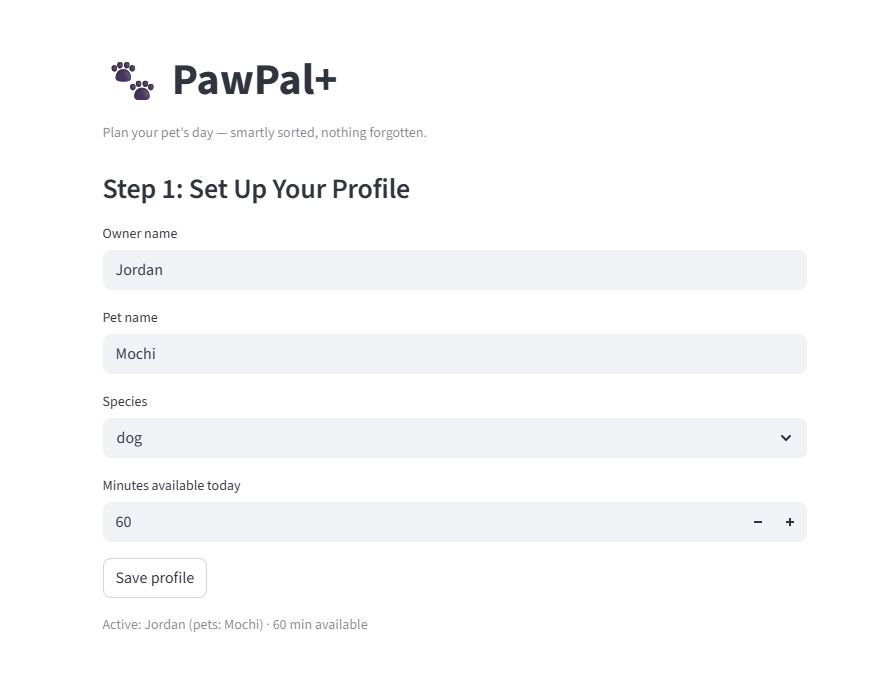
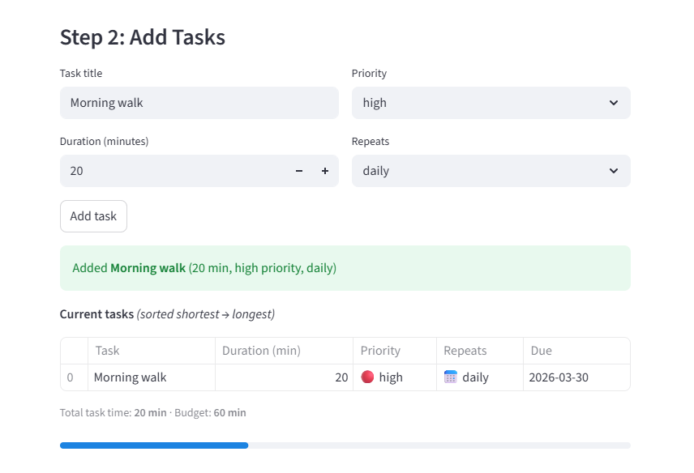
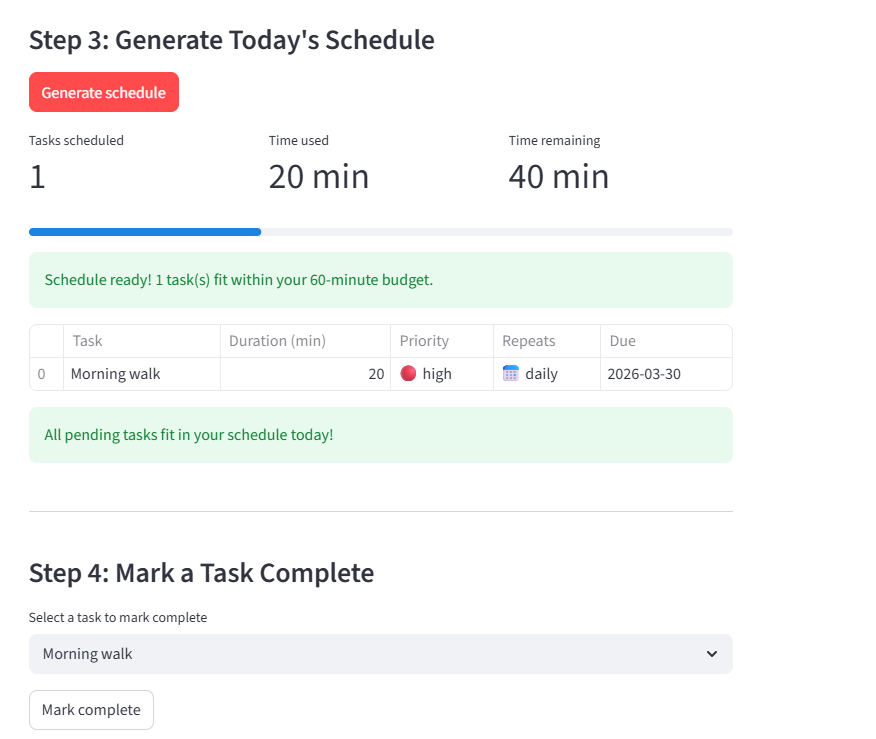
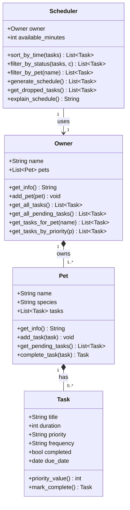

# PawPal+ (Module 2 Project)

A Streamlit app that helps a pet owner plan daily care tasks. Smartly sorted, nothing forgotten.

## Features

| Feature | Algorithm / Method | What it does |
|---------|-------------------|--------------|
| **Priority-first scheduling** | `Scheduler.generate_schedule()` | Sorts tasks by priority (high → medium → low) using a numeric key, then greedily fits them into the available time budget |
| **Duration tiebreaker** | Sort key: `(-priority_value(), duration)` | When two tasks share the same priority, the shorter one is scheduled first to maximize tasks completed |
| **Sorting by time** | `Scheduler.sort_by_time()` | Returns any task list ordered shortest → longest duration; used in the UI to preview tasks at a glance |
| **Dropped-task / conflict warnings** | `Scheduler.get_dropped_tasks()` | Detects tasks that were evaluated but couldn't fit in the remaining budget; surfaces them as `st.warning` banners so nothing is silently skipped |
| **Live budget progress bar** | Inline in Step 2 | Calculates total pending time vs. available minutes before schedule generation; shows `st.warning` if tasks already exceed the budget |
| **Daily recurrence** | `Task.mark_complete()` + `timedelta(days=1)` | Completing a daily task creates a new Task instance due the following day and appends it to the pet's task list |
| **Weekly recurrence** | `Task.mark_complete()` + `timedelta(weeks=1)` | Same mechanism, advancing the due date by 7 days |
| **One-off (as-needed) tasks** | `frequency="as-needed"` → returns `None` | Tasks that don't repeat are marked complete without generating a successor |
| **Filter by pet** | `Scheduler.filter_by_pet()` | Isolates tasks for a named pet across a multi-pet owner |
| **Filter by status** | `Scheduler.filter_by_status()` | Separates pending from completed tasks for display or scheduling |

---

## 📸 Demo

### Step 1: Set up your profile


### Step 2: Add tasks (sorted shortest to longest, with live budget bar)


### Step 3: Generate schedule (metrics, priority table, dropped-task warnings)


---

You are building **PawPal+**, a Streamlit app that helps a pet owner plan care tasks for their pet.

## Scenario

A busy pet owner needs help staying consistent with pet care. They want an assistant that can:

- Track pet care tasks (walks, feeding, meds, enrichment, grooming, etc.)
- Consider constraints (time available, priority, owner preferences)
- Produce a daily plan and explain why it chose that plan

Your job is to design the system first (UML), then implement the logic in Python, then connect it to the Streamlit UI.

## What you will build

Your final app should:

- Let a user enter basic owner + pet info
- Let a user add/edit tasks (duration + priority at minimum)
- Generate a daily schedule/plan based on constraints and priorities
- Display the plan clearly (and ideally explain the reasoning)
- Include tests for the most important scheduling behaviors

## Getting started

### Setup

```bash
python -m venv .venv
source .venv/bin/activate  # Windows: .venv\Scripts\activate
pip install -r requirements.txt
```

### Suggested workflow

1. Read the scenario carefully and identify requirements and edge cases.
2. Draft a UML diagram (classes, attributes, methods, relationships).
3. Convert UML into Python class stubs (no logic yet).
4. Implement scheduling logic in small increments.
5. Add tests to verify key behaviors.
6. Connect your logic to the Streamlit UI in `app.py`.
7. Refine UML so it matches what you actually built.

## System Design

### Core Objects

**`Owner`**: the person using the app
- Attributes: `name`
- Methods: `get_info()`

**`Pet`**: the animal being cared for
- Attributes: `name`, `species`
- Methods: `get_info()`

**`Task`**: a single care activity
- Attributes: `title`, `duration` (minutes), `priority` (`"low"`, `"medium"`, `"high"`)
- Methods: `priority_value()`, converts priority to a number for sorting

**`Scheduler`**: builds the daily plan
- Attributes: `owner`, `tasks`
- Methods: `add_task()`, `generate_schedule()`, `explain_schedule()`

### Three Core User Actions
1. **Add a Pet**: enter owner name, pet name, and species
2. **Add a Task**: enter task title, duration, and priority
3. **Generate Today's Schedule**: produce an ordered plan with explanation

### Class Diagram



## Testing PawPal+

Run the full test suite from the project root:

```bash
python -m pytest
```

Add `-v` for verbose output showing each test name:

```bash
python -m pytest -v
```

### What the tests cover

| Category | Tests | Description |
|----------|-------|-------------|
| **Sorting correctness** | 3 | Verifies `sort_by_time()` returns tasks shortest-first, and `generate_schedule()` orders by priority descending with duration as a tiebreaker |
| **Recurrence logic** | 5 | Confirms daily tasks recur the next day, weekly tasks recur 7 days later, `as-needed` tasks return `None`, and `Pet.complete_task()` correctly appends (or does not append) the next occurrence |
| **Conflict / budget detection** | 5 | Verifies the scheduler drops tasks that exceed the remaining time budget, handles a 0-minute budget, schedules a task that exactly fills the budget, and produces an empty schedule when all tasks are already complete |

Tests live in `tests/test_pawpal.py` and are configured via `pytest.ini` so `python -m pytest` works from any directory in the project.

## Smarter Scheduling

The scheduler goes beyond a simple ordered list. Four algorithmic improvements make it more useful for real pet care:

**Priority + duration tiebreaker**: Tasks are sorted by priority first (high before medium before low). When two tasks share the same priority, the shorter one is scheduled first, fitting more tasks into the available time window.

**Sorting and filtering**: `Scheduler.sort_by_time()` returns tasks ordered by duration. `filter_by_status()` separates pending from completed tasks. `filter_by_pet()` isolates tasks for a specific pet by name.

**Recurring tasks**: Each `Task` has a `frequency` (`"daily"`, `"weekly"`, `"as-needed"`) and a `due_date`. Calling `Pet.complete_task()` marks the task done and automatically queues a new instance with the next due date using Python's `timedelta`. One day ahead for daily tasks, one week ahead for weekly. Tasks marked `"as-needed"` do not recur.

**Dropped task reporting**: `Scheduler.get_dropped_tasks()` returns any pending tasks that were evaluated but could not fit within the available time budget, so the owner knows what was skipped rather than silently losing it.
