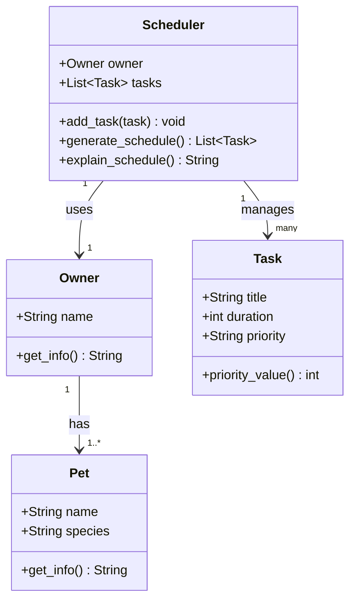

# PawPal+ (Module 2 Project)

You are building **PawPal+**, a Streamlit app that helps a pet owner plan care tasks for their pet.

## Scenario

A busy pet owner needs help staying consistent with pet care. They want an assistant that can:

- Track pet care tasks (walks, feeding, meds, enrichment, grooming, etc.)
- Consider constraints (time available, priority, owner preferences)
- Produce a daily plan and explain why it chose that plan

Your job is to design the system first (UML), then implement the logic in Python, then connect it to the Streamlit UI.

## What you will build

Your final app should:

- Let a user enter basic owner + pet info
- Let a user add/edit tasks (duration + priority at minimum)
- Generate a daily schedule/plan based on constraints and priorities
- Display the plan clearly (and ideally explain the reasoning)
- Include tests for the most important scheduling behaviors

## Getting started

### Setup

```bash
python -m venv .venv
source .venv/bin/activate  # Windows: .venv\Scripts\activate
pip install -r requirements.txt
```

### Suggested workflow

1. Read the scenario carefully and identify requirements and edge cases.
2. Draft a UML diagram (classes, attributes, methods, relationships).
3. Convert UML into Python class stubs (no logic yet).
4. Implement scheduling logic in small increments.
5. Add tests to verify key behaviors.
6. Connect your logic to the Streamlit UI in `app.py`.
7. Refine UML so it matches what you actually built.

## System Design

### Core Objects

**`Owner`** — the person using the app
- Attributes: `name`
- Methods: `get_info()`

**`Pet`** — the animal being cared for
- Attributes: `name`, `species`
- Methods: `get_info()`

**`Task`** — a single care activity
- Attributes: `title`, `duration` (minutes), `priority` (`"low"`, `"medium"`, `"high"`)
- Methods: `priority_value()` — converts priority to a number for sorting

**`Scheduler`** — builds the daily plan
- Attributes: `owner`, `tasks`
- Methods: `add_task()`, `generate_schedule()`, `explain_schedule()`

### Three Core User Actions
1. **Add a Pet** — enter owner name, pet name, and species
2. **Add a Task** — enter task title, duration, and priority
3. **Generate Today's Schedule** — produce an ordered plan with explanation

### Class Diagram



## Smarter Scheduling

The scheduler goes beyond a simple ordered list. Four algorithmic improvements make it more useful for real pet care:

**Priority + duration tiebreaker** — Tasks are sorted by priority first (high before medium before low). When two tasks share the same priority, the shorter one is scheduled first, fitting more tasks into the available time window.

**Sorting and filtering** — `Scheduler.sort_by_time()` returns tasks ordered by duration. `filter_by_status()` separates pending from completed tasks. `filter_by_pet()` isolates tasks for a specific pet by name.

**Recurring tasks** — Each `Task` has a `frequency` (`"daily"`, `"weekly"`, `"as-needed"`) and a `due_date`. Calling `Pet.complete_task()` marks the task done and automatically queues a new instance with the next due date using Python's `timedelta` — one day ahead for daily tasks, one week ahead for weekly. Tasks marked `"as-needed"` do not recur.

**Dropped task reporting** — `Scheduler.get_dropped_tasks()` returns any pending tasks that were evaluated but could not fit within the available time budget, so the owner knows what was skipped rather than silently losing it.
